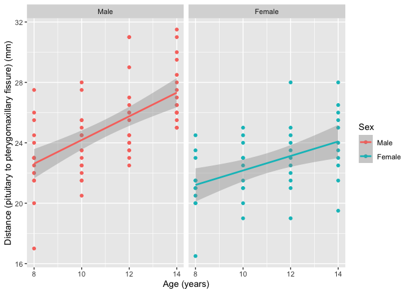
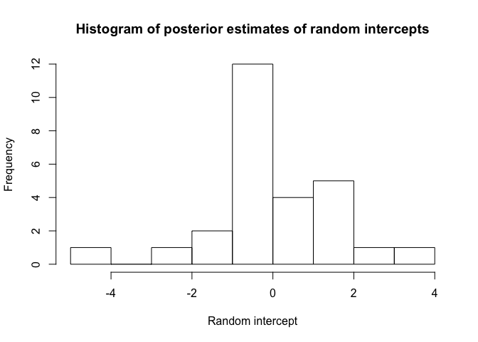
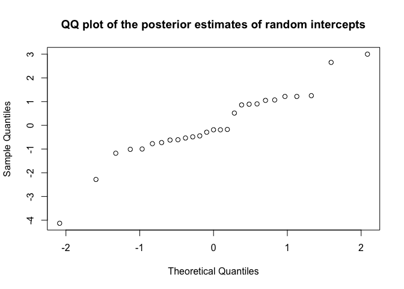
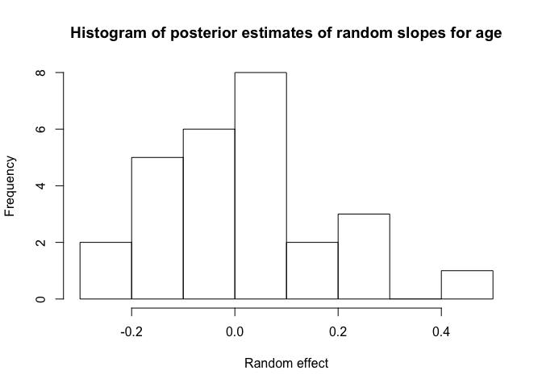
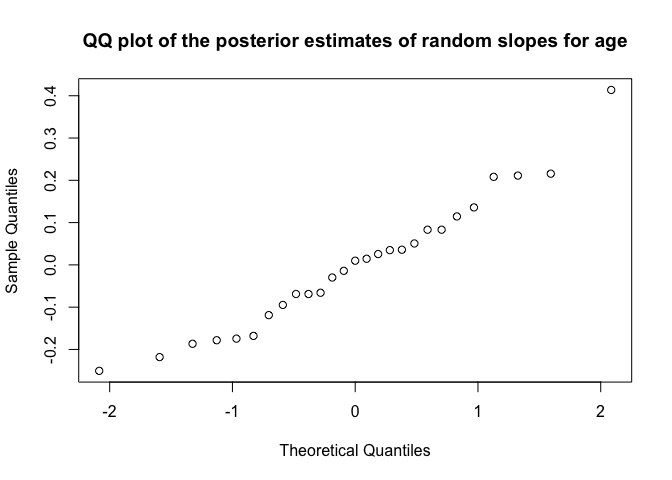
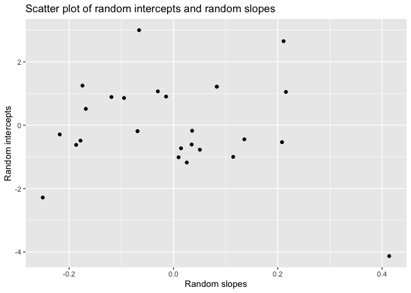
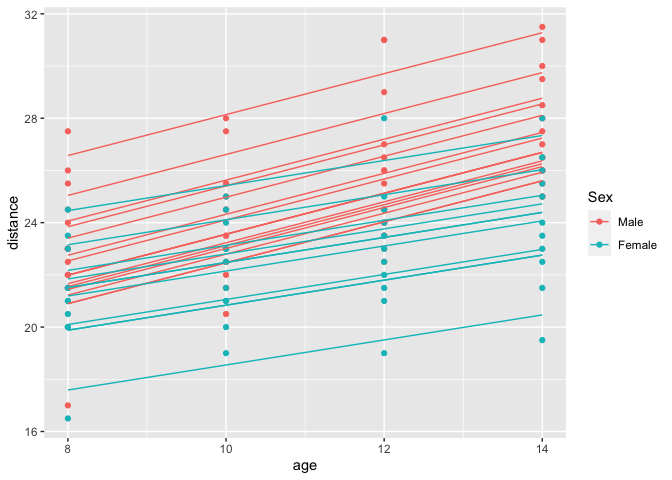
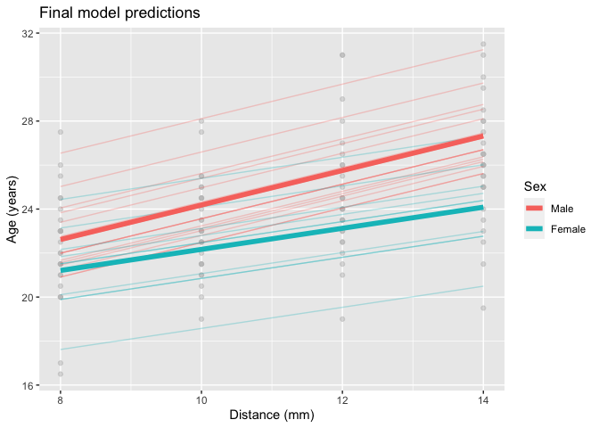

HDAT9700: Assessment 1C - Chapters 6, 7 and 8
================
Mark Hanly
25 Nov 2020

### Assignment

-----

## Question 1

1.  Familiarise yourself with the Orthodont dataset.
    1.  How many rows (observations) are there in the dataset, and how
        many children are there in the dataset? \[3 marks\]
    2.  Provide frequencies (%) for the categories of the categorical
        variables, and median and 1st and 3rd quartiles for the
        continuous variables. \[3 marks\]

-----

**Solution 1(i)**

There are 108 rows in the data and 27 children.

**Solution 1(ii)**

    ##    Min. 1st Qu.  Median    Mean 3rd Qu.    Max. 
    ##   16.50   22.00   23.75   24.02   26.00   31.50

    ## 
    ##  8 10 12 14 
    ## 27 27 27 27

    ## # A tibble: 2 x 3
    ##   Sex        n   pct
    ##   <fct>  <int> <dbl>
    ## 1 Male      16  59.3
    ## 2 Female    11  40.7

  - The median distance across all ages and time points is 23.75mm,
    interquartile range = 22-26mm
  - 25% of records are at ages 8 years, 10 years, 12 years and 14 years.
  - 11 out of 27 children (41%) are girls and 16/27 children (59%) are
    boys

-----

## Question 2

2.  In this assignment, we are interested in modelling the variable
    **distance** as a function of **age** and **sex**.
    1)  What is the multilevel structure of this dataset? \[3 marks\]
    2)  Age will be modelled as a random effect for the analysis. Why
        might this be appropriate? \[5 marks\]
    3)  Use the function `ggplot()` and the following code to produce a
        scatterplot of age by distance, separately for each sex.
        Summarise the relationship between distance, age and sex. \[3
        marks\]

-----

**Solution 2(i)**

The data are a two level hierachy with observations at level 1 nested
within children at level 2. Level 1 variables (observations) are
distance and age. Level 2 variables (child) are Subject and Sex.

**Solution 2(ii)**

It may be appropriate to model age as a random effect because it is
plausible that the relationship between age and
pituitary-pterygomaxillary fissure distance will vary between children
due to unmeasured factors (such as environment, nutritional intake or
genetic factors). By treating age as a random effect in the analysis we
can capture the fact that children don’t all grow at the same rate and
quantify this variation in the model.

**Solution 2(iii)**

<!-- -->

From this exploratory data analysis, we can see that distance increases
with age, on average, for both boys and girls. Boys have a higher
distance than girls on average at age 8 (around 22.5mm versus 21.5mm)
and the slope appears to be steeper for boys, who have an average
distance of around 27, at age 14 compared to 24mm for girls.

-----

## Question 3

3.  We will now begin to build a regression model to further investigate
    the relationship between **distance**, **age** and **sex**. We would
    like to test the hypothesis that age and sex are significantly
    related to distance.
    1)  Create a single-level intercept-only model for distance. \[3
        marks\]
    2)  Create a variance-components (intercept only) model for distance
        with a random intercept. \[3 marks\]
    3)  Perform a suitable test to compare the models in 3i) and 3b).
        \[3 marks\]
    4)  In this study, is it justified to use a hierarchical model? \[6
        marks\]

-----

**Solution 3(i)**

    ## 
    ## Call:
    ## lm(formula = distance ~ 1, data = orth)
    ## 
    ## Residuals:
    ##     Min      1Q  Median      3Q     Max 
    ## -7.5231 -2.0231 -0.2731  1.9769  7.4769 
    ## 
    ## Coefficients:
    ##             Estimate Std. Error t value Pr(>|t|)    
    ## (Intercept)  24.0231     0.2818   85.25   <2e-16 ***
    ## ---
    ## Signif. codes:  0 '***' 0.001 '**' 0.01 '*' 0.05 '.' 0.1 ' ' 1
    ## 
    ## Residual standard error: 2.929 on 107 degrees of freedom

  - The average distance across all subjects and timepoints is 24mm

**Solution 3(ii)**

    ## Linear mixed-effects model fit by maximum likelihood
    ##  Data: orth 
    ##        AIC      BIC    logLik
    ##   521.4911 529.5375 -257.7456
    ## 
    ## Random effects:
    ##  Formula: ~1 | Subject
    ##         (Intercept) Residual
    ## StdDev:    1.888748 2.220312
    ## 
    ## Fixed effects: distance ~ 1 
    ##                Value Std.Error DF  t-value p-value
    ## (Intercept) 24.02315 0.4235945 81 56.71261       0
    ## 
    ## Standardized Within-Group Residuals:
    ##        Min         Q1        Med         Q3        Max 
    ## -3.2390731 -0.5247645 -0.1103326  0.4827195  2.7734496 
    ## 
    ## Number of Observations: 108
    ## Number of Groups: 27

    ## [1] "3.567368"

  - The estimated variance of the child residuals is
    \(1.889^2 = 3.57mm\)

**Solution 3(iii)**

    ##    Model df      AIC      BIC    logLik   Test L.Ratio p-value
    ## m1     1  3 521.4911 529.5375 -257.7456                       
    ## m0     2  2 541.5816 546.9459 -268.7908 1 vs 2 22.0905  <.0001

    ## log likelihood for single level model: -268.79

    ## log likelihood for intercept-only multilevel model: -268.79

    ## Test statistic: 22.09

    ## p value =  2.600945e-06

  - The test statistic for the likelihood ratio test comparing the
    single level model for distance to the random intercept model is
    22.09 on 1 degree of freedom. It would be highly unlikely to see a
    test statistic this high if the single level model was a better fit,
    therefore we reject that hypothesis and conclude that the the random
    intercept model is a better model for the data.

**Solution 3(iv)**

From the comparison of the single level model to the intercept-only
model, it does appear justified to use a hierarchical model. To further
support this decision we can calculate the Variance Components
Coefficient (VPC), which quantifies the proportion of variance that can
be attributed to observations over time (level 1) and individuals (level
2).

    ## Subject = pdLogChol(1) 
    ##             Variance StdDev  
    ## (Intercept) 3.567368 1.888748
    ## Residual    4.929783 2.220312

  - The level 1 variance is 3.6
  - The level 2 variance is 4.9
  - The variance partition coefficient is 0.58 indicating that around
    58% of the variation in distance is attributable to difference
    between children. This is a very high proportion attributable to the
    higher level of the model, further supporting the choice of a
    hierarchical model

-----

## Question 4

4.  We will now incorporate the variable **age** into the model created
    in 3ii) above.
    1)  Create a longitudinal multilevel linear model with random
        intercept only to investigate the effect of age on distance
        (distance \~ age). \[3 marks\]
    2)  Now add a random slope to the variable age in the longitudinal
        multilevel linear model created in 4i). \[3 marks\]
    3)  Perform a suitable test to compare the two models in 4i) and
        4ii). \[3 marks\]
    4)  What is the sign of the estimated covariance parameter from the
        random part of the model, and what does this suggest about the
        relationship between random intercepts and random slopes? \[6
        marks\]
    5)  Draw a plot to help assess whether the posterior estimates of
        the random intercepts and random slopes are normally
        distributed. \[6 marks\]
    6)  In this study, does the use of a random slope for age improve
        the goodness-of-fit of the model? \[3 marks\]

-----

**Solution 4(i)**

    ## Linear mixed-effects model fit by REML
    ##  Data: orth 
    ##        AIC      BIC    logLik
    ##   455.0025 465.6563 -223.5013
    ## 
    ## Random effects:
    ##  Formula: ~1 | Subject
    ##         (Intercept) Residual
    ## StdDev:    2.114724 1.431592
    ## 
    ## Fixed effects: distance ~ 1 + age 
    ##                 Value Std.Error DF  t-value p-value
    ## (Intercept) 16.761111 0.8023952 80 20.88885       0
    ## age          0.660185 0.0616059 80 10.71626       0
    ##  Correlation: 
    ##     (Intr)
    ## age -0.845
    ## 
    ## Standardized Within-Group Residuals:
    ##         Min          Q1         Med          Q3         Max 
    ## -3.66453932 -0.53507984 -0.01289591  0.48742859  3.72178465 
    ## 
    ## Number of Observations: 108
    ## Number of Groups: 27

  - This model indicates that for the average child, a one year increase
    in age is associated with a 0.66mm increase in distance.

**Solution 4(ii)**

    ## Linear mixed-effects model fit by REML
    ##  Data: orth 
    ##        AIC      BIC    logLik
    ##   454.6367 470.6173 -221.3183
    ## 
    ## Random effects:
    ##  Formula: ~1 + age | Subject
    ##  Structure: General positive-definite, Log-Cholesky parametrization
    ##             StdDev    Corr  
    ## (Intercept) 2.3270341 (Intr)
    ## age         0.2264278 -0.609
    ## Residual    1.3100397       
    ## 
    ## Fixed effects: distance ~ 1 + age 
    ##                 Value Std.Error DF   t-value p-value
    ## (Intercept) 16.761111 0.7752460 80 21.620377       0
    ## age          0.660185 0.0712533 80  9.265333       0
    ##  Correlation: 
    ##     (Intr)
    ## age -0.848
    ## 
    ## Standardized Within-Group Residuals:
    ##          Min           Q1          Med           Q3          Max 
    ## -3.223106060 -0.493761143  0.007316631  0.472151118  3.916033216 
    ## 
    ## Number of Observations: 108
    ## Number of Groups: 27

**Solution 4(iii)**

  - From this random intercept-random slope model we can see that the
    variation in the random slope for age is quite small
    (\(\sigma_{u1}^2 = 0.05\))

<!-- end list -->

    ##    Model df      AIC      BIC    logLik   Test L.Ratio p-value
    ## m2     1  4 455.0025 465.6563 -223.5013                       
    ## m3     2  6 454.6367 470.6173 -221.3183 1 vs 2 4.36583  0.1127

  - The test statistic for the likelihood ratio test comparing the
    random intercept model (m2) to the random slope model (m3) is 4.366
    on 1 degree of freedom, p=0.11. This suggests that the random
    intercept model is not an improvement. The data do not suggest that
    the effect of age on distance varies between children.

**Solution 4(iv)**

The sign of the covariance parameter is negative, indicating a negative
association between random intercepts and random slopes. In other words,
under this model children with above average random intercepts are
expected to have below average random slopes, and children with below
average random intercepts are expected to have above average random
slopes. This would produce a “fanning in” pattern for the regression
lines for individual children.

However, looking at the confidence intervals for the covariance term
using the `intervals()` function highlights that the covariance is
estimated very imprecisely:

    ## $Subject
    ##                           lower       est.     upper
    ## sd((Intercept))       0.9485605  2.3270341 5.7087424
    ## sd(age)               0.1025090  0.2264278 0.5001467
    ## cor((Intercept),age) -0.9382505 -0.6093329 0.2981686
    ## 
    ## attr(,"label")
    ## [1] "Random Effects:"

So although the point estimate is negative, taking the confidence
intervals into account we can see that the covariance parameter is not
statistically distinguishable from zero. The reason for this imprecise
estimate becomes apparent in the answer to the next question.

**Solution 4(v)**

<!-- --><!-- --><!-- --><!-- -->

  - The plots indicate that the posterior estimates of the random
    intercepts and random slopes appear slightly skewed. We can
    investigate further by plotting a scatterplot of the random
    intercepts versus random slopes.

<!-- -->

  - The scatter plot indicates that there is an outlier with a
    noticeably low intercept and high slope. This individual is likely
    influencing the observed negative slope between the random
    intercepts and random slopes; without this individual there is no
    obvious negative association. Let’s have a closer look at this
    outlier:

<!-- end list -->

    ##   Subject (Intercept)       age
    ## 1     M13   -4.129544 0.4136685

    ## Grouped Data: distance ~ age | Subject
    ##    distance age Subject  Sex
    ## 49     17.0   8     M13 Male
    ## 50     24.5  10     M13 Male
    ## 51     26.0  12     M13 Male
    ## 52     29.5  14     M13 Male

Further inspection shows that the outlier is child M13 - a boy who’s
distance went form 17mm at age 8 to 29.5 at age 14. Quite a growth
spurt, compared to the other children in the sample\! This outlier is
skewing the data and resulting in the imprecise estimate of the level 2
covariance parameter.

**Solution 4(vi)**

No, specifying a random effect for age does not improve the
goodness-of-fit. We can see this from the non-significant LR test
comparing the random slope to the random intercept model and also from
the limited decrease in AIC when the random slope is included.

-----

## Question 5

5.  In this exercise, we will test whether the relationship between
    **age** and **distance** is improved by the use of a non-linear
    quadratic function in the regression model (i.e. a growth curve
    model).
    1)  Based on your results in section 4 above, which model will you
        use as the basis for your growth curve model? **Justify your
        choice** \[3 marks\]
          - Random intercept only (4i)?
        
          - Random intercept and slope (4ii)?
    2)  Now perform a growth curve analysis by adding the term `age^2`
        to the model you have selected in 5i). \[3 marks\]
    3)  Perform a suitable test to compare the two models in 5ii) and
        either 4i) or 4ii). \[3 marks\]
    4)  In this study, does the use of a non-linear quadratic term for
        age improve the goodness-of-fit of the model? \[3 marks\]

-----

**Solution 5(i)**

Based on the previous analysis, we will specify the random part of the
model as random intercept only. This is based on the non-significant
likelihood test comparing the random intercept model to the random slope
model, and the small change in AIC (we would expect a larger drop in AIC
if the random slope model was an improvement).

**Solution 5(ii)**

    ## Linear mixed-effects model fit by REML
    ##  Data: orth 
    ##        AIC      BIC    logLik
    ##   461.1953 474.4651 -225.5977
    ## 
    ## Random effects:
    ##  Formula: ~1 | Subject
    ##         (Intercept) Residual
    ## StdDev:    2.114273 1.434254
    ## 
    ## Fixed effects: distance ~ 1 + age + I(age^2) 
    ##                 Value Std.Error DF  t-value p-value
    ## (Intercept) 20.117593  4.082174 79 4.928156  0.0000
    ## age          0.023611  0.761567 79 0.031003  0.9753
    ## I(age^2)     0.028935  0.034503 79 0.838633  0.4042
    ##  Correlation: 
    ##          (Intr) age   
    ## age      -0.991       
    ## I(age^2)  0.980 -0.997
    ## 
    ## Standardized Within-Group Residuals:
    ##        Min         Q1        Med         Q3        Max 
    ## -3.7383747 -0.5330585  0.0399517  0.4204626  3.7958683 
    ## 
    ## Number of Observations: 108
    ## Number of Groups: 27

  - The parameter for the quadratic term is positive, suggesting that
    distance increases at a faster rate with age, but it is not
    statistically significant.

**Solution 5(iii)**

    ##       Model df      AIC      BIC    logLik   Test   L.Ratio p-value
    ## m2_ml     1  4 451.3895 462.1181 -221.6948                         
    ## m4_ml     2  5 452.6716 466.0823 -221.3358 1 vs 2 0.7179197  0.3968

  - The LR test indicates that adding the quadratic term did not improve
    the model fit

**Solution 5(iv)**

  - No, including the quadratic term did not improve the goodness of
    fit. This is evident from the non-significant p-value for the
    quadratic term, the non-significant result from the likelihood ratio
    test, and from the increase in AIC comparing the model with the
    linear term to the model with the quadratic term.

-----

## Question 6

6.  For our final model, we will now add the fixed effect **sex** to our
    model of the relationship between distance and age.
    1)  Which model would you choose as your final random effects model?
        \[3 marks\]
          - Random intercept only with no quadratic term (linear model)
          - Random intercept only with quadratic term (growth curve
            model)?
          - Random intercept and slope with no quadratic term (linear
            model)
          - Random intercept and slope with quadratic term (growth curve
            model)?
    2)  Add the fixed effect **Sex** to the model chosen in 6i). Is
        there a significant relationship between distance and sex? \[3
        marks\]
    3)  Add an interaction term between the variables **sex** and
        **age**. Is this interaction significant? What does that mean?
        \[6 marks\]

-----

**Solution 6(i)**  
The analyses in questions 4 and 5 suggest that the preferred model is
the random intercept only with no quadratic term (linear model).

**Solution 6(ii)**

    ## Linear mixed-effects model fit by REML
    ##  Data: orth 
    ##        AIC      BIC    logLik
    ##   447.5125 460.7823 -218.7563
    ## 
    ## Random effects:
    ##  Formula: ~1 | Subject
    ##         (Intercept) Residual
    ## StdDev:    1.807425 1.431592
    ## 
    ## Fixed effects: distance ~ 1 + age + Sex 
    ##                 Value Std.Error DF   t-value p-value
    ## (Intercept) 17.706713 0.8339225 80 21.233044  0.0000
    ## age          0.660185 0.0616059 80 10.716263  0.0000
    ## SexFemale   -2.321023 0.7614168 25 -3.048294  0.0054
    ##  Correlation: 
    ##           (Intr) age   
    ## age       -0.813       
    ## SexFemale -0.372  0.000
    ## 
    ## Standardized Within-Group Residuals:
    ##         Min          Q1         Med          Q3         Max 
    ## -3.74889609 -0.55034466 -0.02516628  0.45341781  3.65746539 
    ## 
    ## Number of Observations: 108
    ## Number of Groups: 27

  - From this model, the estimated parameter for Sex is -2.32 (se=0.76,
    p\<0.01). This indicates that there is a significant relationship
    between distance and sex, with distance lower for girls by 2.3mm on
    average.

**Solution 6(iii)**

    ## Linear mixed-effects model fit by REML
    ##  Data: orth 
    ##        AIC      BIC    logLik
    ##   445.7572 461.6236 -216.8786
    ## 
    ## Random effects:
    ##  Formula: ~1 | Subject
    ##         (Intercept) Residual
    ## StdDev:    1.816214 1.386382
    ## 
    ## Fixed effects: distance ~ 1 + age + Sex + age:Sex 
    ##                   Value Std.Error DF   t-value p-value
    ## (Intercept)   16.340625 0.9813122 79 16.651810  0.0000
    ## age            0.784375 0.0775011 79 10.120823  0.0000
    ## SexFemale      1.032102 1.5374208 25  0.671321  0.5082
    ## age:SexFemale -0.304830 0.1214209 79 -2.510520  0.0141
    ##  Correlation: 
    ##               (Intr) age    SexFml
    ## age           -0.869              
    ## SexFemale     -0.638  0.555       
    ## age:SexFemale  0.555 -0.638 -0.869
    ## 
    ## Standardized Within-Group Residuals:
    ##         Min          Q1         Med          Q3         Max 
    ## -3.59804400 -0.45461690  0.01578365  0.50244658  3.68620792 
    ## 
    ## Number of Observations: 108
    ## Number of Groups: 27

  - The interaction term is significant, which indicates that the
    relationship between age and distance is different for boys and
    girls. The estimated parameter for the interaction term is -0.30
    (se=0.12, p \<0.05). The negative sign here indicates that the
    relationship between distance and age is weaker for girls, as
    suggested by the exploratory analysis.

  - The estimated parameter for `Sex` is positive and non-significant
    here. **BUT** bear in mind that in the presence of the interaction
    term, this parameter is interpreted as the difference between girls
    and boys at the baeline value of age i.e. *at age = 0*. Making
    inferences about the distance measure for newborns is not sensible
    because that is extrapolating well beyond the observed range of ages
    in the data. In the final question I will recode the `age` variable
    to simplify the interpretation.

To get a better idea of the interaction between age and sex on distance
lets predict from the fitted model and plot the result:

<!-- -->

  - We can see that the fitted lines for boys are slighly steeper than
    the fitted lines for girls.

-----

## Question 7

7.  Based on your final model, write a paragraph to report the main
    findings of your analysis. Include the main statistical results
    supported by key values from the output (hint: use the intervals()
    function to obtain 95% intervals for your regression parameters).
    Provide a very brief clinical interpretation of your findings (hint:
    do the results support the hypothesis that there is a relationship
    between distance, age and sex?). \[20 marks\]

**Solution 7**

To aid interpretation I will first recode the age variable by
subtracting 8 from each value of age. This means that the baseline group
(i.e. the interpretation for the intercept parameter) will be boys aged
8 rather than boys aged 0. The model fit using the recoded values of age
is exaclty the same as the original model. The code is not printed to
the report so review the underlying .Rmd file if you want to see the
code.

**Summary of findings**

The aim of this analysis was to model the relationship between the
pituitary and the pterygomaxillary fissure distance (distance), measured
in millimetres (mm), and age and sex for children. The data comprised
records on 27 children (16 boys and 11 girls), who had their distance
measured by x-ray on four occasions, once every two years between the
ages of 8 and 14.

Our final model for pituitary-pterygomaxillary fissure distance was a
random intercept model with age, sex and the interaction between age and
sex included in the fixed part of the model. The final model is
presented below.

<table style="border-collapse:collapse; border:none;">

<tr>

<th style="border-top: double; text-align:center; font-style:normal; font-weight:bold; padding:0.2cm;  text-align:left; ">

 

</th>

<th colspan="3" style="border-top: double; text-align:center; font-style:normal; font-weight:bold; padding:0.2cm; ">

distance

</th>

</tr>

<tr>

<td style=" text-align:center; border-bottom:1px solid; font-style:italic; font-weight:normal;  text-align:left; ">

Predictors

</td>

<td style=" text-align:center; border-bottom:1px solid; font-style:italic; font-weight:normal;  ">

Estimates

</td>

<td style=" text-align:center; border-bottom:1px solid; font-style:italic; font-weight:normal;  ">

CI

</td>

<td style=" text-align:center; border-bottom:1px solid; font-style:italic; font-weight:normal;  ">

p

</td>

</tr>

<tr>

<td style=" padding:0.2cm; text-align:left; vertical-align:top; text-align:left; ">

(Intercept)

</td>

<td style=" padding:0.2cm; text-align:left; vertical-align:top; text-align:center;  ">

22.62

</td>

<td style=" padding:0.2cm; text-align:left; vertical-align:top; text-align:center;  ">

21.58 – 23.65

</td>

<td style=" padding:0.2cm; text-align:left; vertical-align:top; text-align:center;  ">

<strong>\<0.001

</td>

</tr>

<tr>

<td style=" padding:0.2cm; text-align:left; vertical-align:top; text-align:left; ">

age8

</td>

<td style=" padding:0.2cm; text-align:left; vertical-align:top; text-align:center;  ">

0.78

</td>

<td style=" padding:0.2cm; text-align:left; vertical-align:top; text-align:center;  ">

0.63 – 0.94

</td>

<td style=" padding:0.2cm; text-align:left; vertical-align:top; text-align:center;  ">

<strong>\<0.001

</td>

</tr>

<tr>

<td style=" padding:0.2cm; text-align:left; vertical-align:top; text-align:left; ">

Sex \[Female\]

</td>

<td style=" padding:0.2cm; text-align:left; vertical-align:top; text-align:center;  ">

\-1.41

</td>

<td style=" padding:0.2cm; text-align:left; vertical-align:top; text-align:center;  ">

\-3.09 – 0.27

</td>

<td style=" padding:0.2cm; text-align:left; vertical-align:top; text-align:center;  ">

0.103

</td>

</tr>

<tr>

<td style=" padding:0.2cm; text-align:left; vertical-align:top; text-align:left; ">

age8 \* Sex \[Female\]

</td>

<td style=" padding:0.2cm; text-align:left; vertical-align:top; text-align:center;  ">

\-0.30

</td>

<td style=" padding:0.2cm; text-align:left; vertical-align:top; text-align:center;  ">

\-0.54 – -0.07

</td>

<td style=" padding:0.2cm; text-align:left; vertical-align:top; text-align:center;  ">

<strong>0.015</strong>

</td>

</tr>

<tr>

<td colspan="4" style="font-weight:bold; text-align:left; padding-top:.8em;">

Random Effects

</td>

</tr>

<tr>

<td style=" padding:0.2cm; text-align:left; vertical-align:top; text-align:left; padding-top:0.1cm; padding-bottom:0.1cm;">

σ2

</td>

<td style=" padding:0.2cm; text-align:left; vertical-align:top; padding-top:0.1cm; padding-bottom:0.1cm; text-align:left;" colspan="3">

1.87

</td>

<tr>

<td style=" padding:0.2cm; text-align:left; vertical-align:top; text-align:left; padding-top:0.1cm; padding-bottom:0.1cm;">

τ00 Subject

</td>

<td style=" padding:0.2cm; text-align:left; vertical-align:top; padding-top:0.1cm; padding-bottom:0.1cm; text-align:left;" colspan="3">

3.03

</td>

<tr>

<td style=" padding:0.2cm; text-align:left; vertical-align:top; text-align:left; padding-top:0.1cm; padding-bottom:0.1cm;">

N Subject

</td>

<td style=" padding:0.2cm; text-align:left; vertical-align:top; padding-top:0.1cm; padding-bottom:0.1cm; text-align:left;" colspan="3">

27

</td>

<tr>

<td style=" padding:0.2cm; text-align:left; vertical-align:top; text-align:left; padding-top:0.1cm; padding-bottom:0.1cm; border-top:1px solid;">

Observations

</td>

<td style=" padding:0.2cm; text-align:left; vertical-align:top; padding-top:0.1cm; padding-bottom:0.1cm; text-align:left; border-top:1px solid;" colspan="3">

108

</td>

</tr>

</table>

The estimated variance of the level 2 (Subject) residuals was 3.03mm,
and the estimated level 1 (Observation) variance was 1.87mm. After
controlling for age and sex, around 62% of the variation in distance was
between children and 38% of the variation in distance was between
measurement occasions.

The average distance for 8-year-old boys was 22.6mm (95% CI: 21.6, 23.7)
and the estimated age parameter was 0.78 (95% CI: 0.63, 0.94). This
indicates that for boys the average distance increased by 0.78mm with
each year of age between 8 and 14 years.

At age 8, girls had a shorter distance compared to boys by -1.4mm, but
the estimated difference in distance between boys and girls at this age
was not significant (95% CI: -3.1, 0.3; p = 0.103). The interaction term
between sex and age was -0.30, (95% CI: -0.54, -0.07; p \< 0.05),
confirming that the increase in distance associated with age was
significantly lower for girls compared to boys.

The figure below plots the raw data together with the model predicted
Subject-specific lines and average predicted growth for boys and girls.

<!-- -->

Clinically, the model results indicate that the distance between the
pituitary and the pterygomaxillary fissure at age 8 can be expected to
vary significantly between children. By age 8, boys are expected to have
a higher distance compared to girls on average, but it wouldn’t be
unusual to see girl with an above average distance for a boy or a boy
with a below average distance for a girl at age 8. The fissure distance
increases linearly with age for both boys and girls between ages 8 to
14, but the increase is steeper for boys (around 0.78mm per year)
compared to girls (around 0.48mm per year).

-----
